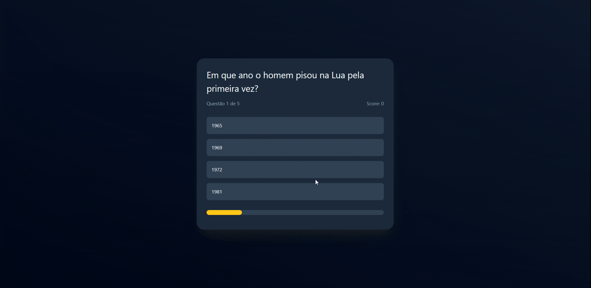

# 🧠 Quiz (React + TS)

Esse é um Quiz App interativo construído com React, TypeScript e TailwindCSS.

> **[🎮 Jogue a versão ao vivo aqui!](https://quizreactts.netlify.app/)**

---

## ✨ Funcionalidades

* **Perguntas Aleatórias:** Cada jogo é único! As perguntas são sorteadas aleatoriamente do banco de dados.
* **Rodadas de 5 Perguntas:** O jogo funciona em rodadas rápidas de 5 perguntas.
* **Feedback Instantâneo:** Respostas corretas ficam verdes e incorretas ficam vermelhas imediatamente após o clique.
* **Contagem de Placar:** O placar (`score`) e o progresso da rodada (`questionAc`) são gerenciados em tempo real.
* **UI Reativa:** Feito com React Hooks para uma experiência de usuário fluida e sem recarregamento de página.

---

## 🛠️ Tecnologias Utilizadas

* **React:** 
* **TypeScript:**
* **TailwindCSS:** 
* **Vite:** 

---

## 🧠 Conceitos Praticados

Este projeto foi fundamental para solidificar meus conhecimentos em React e TypeScript, focando em:

* **Estado (useState):** Gerenciamento complexo de múltiplos estados interdependentes (`gameStage`, `score`, `questionAc`, `answersDisabled`).
* **Renderização Condicional:** Alternância lógica entre os componentes de Início, Jogo (Quiz) e Resultados (Game Over).
* **Renderização de Listas:** Uso do `.map()` para criar dinamicamente os botões de resposta.
* **Estilo Dinâmico:** Manipulação de classes do Tailwind baseada em lógica JavaScript para feedback visual (verde/vermelho).
* **Lógica Assíncrona:** Uso de `setTimeout` para transições suaves entre perguntas.
* **TypeScript Interfaces:** Definição de contratos de dados (`interface Question`, `interface Answer`) para garantir a integridade da aplicação.

